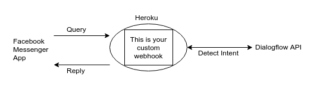
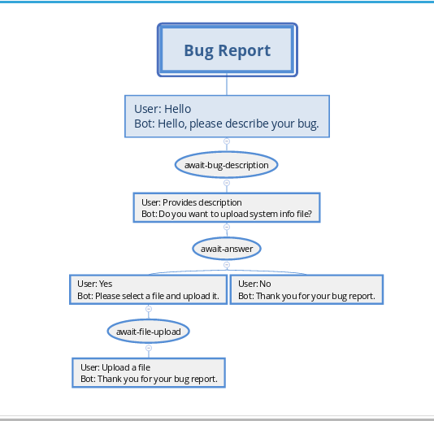
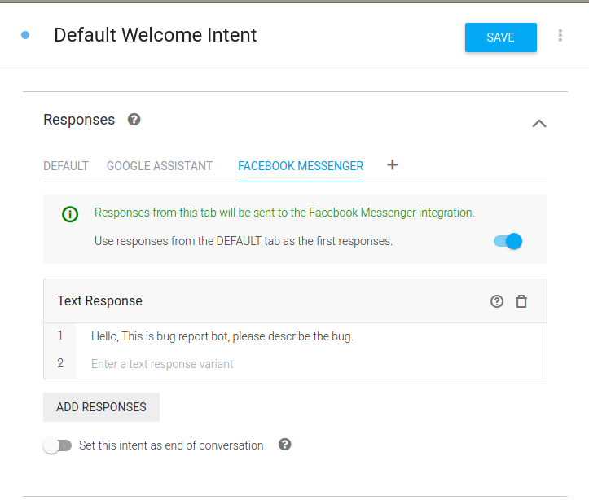
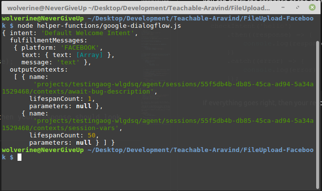
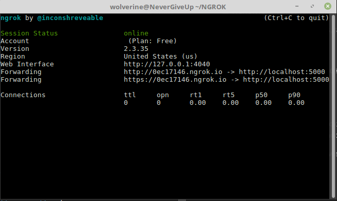
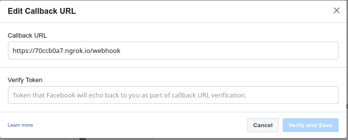

# Facebook Custom Integration [File Upload]

A Chatbot is not an unknown word to us, many big companies are using them to provide better services and user experience. The integration of your Chatbot to your website or any other platform is very easy these days. One of the most popular Chatbot development service **Google Dialogflow** provides **One-Click Integration** for many platforms like Facebook Messenger, Slack, Telegram, etc. but it has some limitations, one of them is, say you need a user to upload a file using your chatbot as a part of the conversation, in this case, **One-Click Integration** will not work, you need to develop a **Custom Integration** for this purpose.

In this tutorial we will develop a **Custom Integration** for **Facebook Messenger** and we will use it with our **Dialogflow Agent** as a **Bug Reporting Chatbot**, we will achieve following things,

- [x] Send and Receive Messages from FB Messenger
- [x] Receive a file from FB Messenger and Save it to Backend

This tutorial is using **NodeJS** as a programing language, **Airtable** as a backend [It is very easy to build a prototype].

> I assume that you have some prior knowledge of Web Application, NodeJS, and Google Dialogflow.

To get the essence of what we are going to build, please take a look at the following explanatory image.



Also, the agent mind-map.



The process of developing a **Custom Integration** is divided into small pieces for better understanding, we will create small code samples and then combine them into a final product.

1. Detect Intent
2. Facebook Messenger [Query & Reply]
3. Airtable as Backend
4. Combine Steps - 1, 2 & 3

So, let's get started.

## Detect Intent

In this section with the help of [Google Dialogflow API](https://cloud.google.com/dialogflow/docs/reference/rest/v2-overview), we will detect the intent of the input query and show the response to the user.

To accomplish this step we will need the following things

- [x] Dialogflow Agent
- [x] Credentials for API[Service Account key]
- [x] Project ID

> I assume that you know how to get API Credentials, but if you don't have then it is a straight-forward process, go to your Dialogflow project, then in Settings, click on the project-id, after that it is self explanatory.

You need to create an agent in [Dialogflow](https://dialogflow.com/), also make sure that in every intent you create must have a response set for Facebook Messenger.

> At this moment this tutorial supports only **Text Response** and **Quick Reply**.



Google Dialogflow API provides a method called detectIntent, with it you can detect the intent of the input query. It will work the same as if you would interact with the Dialogflow chat simulator.

Here is a code sample to detect the intent.

```JavaScript
// Requiered Packages
const dialogflow = require('dialogflow');
const fs = require('fs');
require('dotenv').config();

// Session ID, it can be any string
// We store it in a separate file
const sessionId = fs.readFileSync('key.text').toString();

// Your google dialogflow project-id
const projectId = process.env.PROJECT_ID;

// Your credentials
const jsonData = JSON.parse(process.env.CREDENTIALS);

const config = {
    credentials: {
        private_key: jsonData['private_key'],
        client_email: jsonData['client_email']
    }
}

// Create a session client
const sessionClient = new dialogflow.SessionsClient(config);
const sessionPath = sessionClient.sessionPath(projectId, sessionId);

const checkIntent = async (text) => {

    let request = {
        session: sessionPath,
        queryInput: {
            text: {
                text: text,
                languageCode: 'en-US',
            }
        }
    };

    let response = await sessionClient.detectIntent(request);
    let intent = response[0]['queryResult']['intent']['displayName'];
    let fulfillmentMessages = response[0]['queryResult']['fulfillmentMessages'][0];
    let outputContexts = response[0]['queryResult']['outputContexts'];

    return {
        'intent': intent,
        'fulfillmentMessages': fulfillmentMessages,
        'outputContexts': outputContexts
    };
};
```
Your Google Dialogflow API credentials will look like this.

```JSON
{
  "type": "service_account",
  "project_id": "Your Project ID",
  "private_key_id": "Your Data",
  "private_key": "Your Data",
  "client_email": "Your Data",
  "client_id": "Your Data",
  "auth_uri": "https://accounts.google.com/o/oauth2/auth",
  "token_uri": "https://oauth2.googleapis.com/token",
  "auth_provider_x509_cert_url": "https://www.googleapis.com/oauth2/v1/certs",
  "client_x509_cert_url": "Your Data"
}
```
Also, the `key.txt` file is a simple text file that can hold a single line without space key, we will use this key as a **session-id**.

> When you start a conversation, all context, entities, and everything will be handled by the Dialogflow, you just need to keep the **session-id** same throughout the conversation.

You can check the response of the above code with following code snippet

```JavaScript
checkIntent('hello')
    .then((response) => {
        console.log(response);
    })
    .catch((error) => {
        console.log(error);
    });
```
If everything goes right, then your response should look like this.



## Facebook Messenger [Query & Reply]

In this section, we will send/receive a message from Facebook Messenger to our Webhook.

For this process, you need some prerequisites done before you run the code snippet.

- [x] Facebook Page
- [x] Facebook Messenger App
- [x] Facebook Messenger App Token
- [x] NGROK for Internet Tunneling

We will do this section in small steps, so please, fasten your seatbelt.

### Start NGROK

This is a very easy step, you start **NGROK**, choose any port you wish, you will see the following output. Note down the **Forwarding URL**.



### Verify Your Webhook

In this step, we will verify our webhook with Facebook, so it will send messages received by our chatbot to our webhook.

The process of verifying the webhook is simple, for this we need the following **express** web app.

> When you verify your webhook, Facebook will send a **GET** request to your webhook URL and want some specific response in return.

```JavaScript
const express = require('express');
const bodyParser = require('body-parser');
require('dotenv').config();

const webApp = express();

webApp.use(bodyParser.urlencoded({
    extended: true
}))

webApp.use(bodyParser.json()); 

const PORT = process.env.PORT;
// Any string will work, but we will use the Facebook App Token
const TOKEN = process.env.TOKEN;

// This get method is to check the app is working
webApp.get('/', (req, res) => {
    res.status(200).send(`Hello World.!`);
});

// This method is to verify the Facebook webhook
webApp.get('/webhook', (req, res) => {
    
    let mode = req['query']['hub.mode'];
    let token = req['query']['hub.verify_token'];
    let challenge = req['query']['hub.challenge'];

    if (mode && token) {
        if (mode === 'subscribe' && token === TOKEN) {
            console.log('Webhook verified by Facebook.')
            res.status(200).send(challenge);
        } else {
            res.status(403).send('Forbidden');
        }
    }
});

webApp.listen(PORT, () => {
    console.log(`Server is running at ${PORT}`);
});
```

Run the web app, you see `Server is running at 5000` output on the console.

Go to [Developer Facebook](https://developers.facebook.com/) site and open your application, inside the **Messenger Settings** you will see a **Webhooks** section and **Edit Callback URL**, here paste the **NGROK Forwarding URL** followed by `/webhook`, and **Facebook App Token**, the toke should be same, as you can understand that Facebook will compare both of them at the time of verification.

> You can compare it with my NGROk URL for reference
`https://70ccb0a7.ngrok.io/webhook`



### Facebook Messenger Chat [Query & Reply]

Once our webhook is verified, now we can send and receive messages to the user who interacts with our chatbot.

Before we start this step, we need some functions that will help us,

1. to extract **user query** and **sender-id** from the Facebook request body.
2. to get **reply** from the Dialogflow detectIntent method and convert it to the format Facebook understands.
3. a method that will send message to FB Messenger

So the first method, we can have any of these as our input **GET_STARTED**, **TEXT** and **URL** of the uploaded file. We pass the requested body from the FB Messenger. 

```JavaScript
// Get senderID, text, and URL from the incoming message
// from Facebook Messenger
const getSenderIDText = (body) => {

    let messageData = {};

    let entry = body['entry'][0];
    let messaging = entry['messaging'][0];
    let senderID = messaging['sender']['id'];

    messageData['senderID'] = senderID;

    try {
        messageData['GET_STARTED'] = messaging['postback']['title'];
    } catch (error) {
        messageData['GET_STARTED'] = 'NO-DATA';
    }

    try {
        messageData['messageText'] = messaging['message']['text'];
    } catch (error) {
        messageData['messageText'] = 'NO-DATA';
    }

    try {
        messageData['URL'] = messaging['message']['attachments'][0]['payload']['url'];
    } catch (error) {
        messageData['URL'] = 'NO-DATA';
    }

    return messageData;
};
```

and the second method, we pass the **fulfillmentMessages** from the **checkIntent** method. 

```JavaScript
// Format the output of Dialogflow
// and make it ready for Facebook Messenger
const formatMessage = (fulfillmentMessages) => {

    if (fulfillmentMessages['message'] === 'text') {

        let formatMessageData = {
            'text': fulfillmentMessages['text']['text'][0]
        }
        return formatMessageData;
    } else if (fulfillmentMessages['message'] === 'quickReplies') {

        let quickReplies = fulfillmentMessages['quickReplies']['quickReplies'];
        let text = fulfillmentMessages['quickReplies']['title'];
        let quick_replies = [];
        quickReplies.forEach(qr => {
            let tempDict = {};

            tempDict['content_type'] = 'text';
            tempDict['title'] = qr;
            tempDict['payload'] = '<POSTBACK_PAYLOAD>'
            
            quick_replies.push(tempDict);
        });

        let formatMessageData = {
            'text': text,
            'quick_replies': quick_replies
        }

        return formatMessageData;
    }
};
```

Now, our code is set to send and receive a message from Facebook Messenger Chatbot.

When FB Messenger Chatbot receives a message from a user, it will send a **POST** request to our webhook URL, so we need to make a **POST** method in our wep app.

```JavaScript
// This method is called when someone
// sends message to the chatbot
webApp.post('/webhook', async (req, res) => {
    
    let body = req['body'];

    let messageData = getSenderIDText(body);

    // Message is Get-Started
    if (body['object'] === 'page' && messageData['GET_STARTED'] !== 'NO-DATA') {

        // Detect intent
        let intentData = await checkIntent('hello');
        // Formate the message
        let formatMessageData = formatMessage(intentData['fulfillmentMessages']);
        // Send the message
        sendMessage(messageData['senderID'], formatMessageData);
        res.status(200).send('OK');
    
    // Message is an attachment
    } else if ((body['object'] === 'page' && messageData['URL'] !== 'NO-DATA')) {

        // to insert the data we will train an intent with
        // training phrase image
        let intentData = await checkIntent('image');
        let formatMessageData = formatMessage(intentData['fulfillmentMessages']);
        let bug = intentData['outputContexts'][0]['parameters']['fields']['any.original']['stringValue'];
        let fields = {
            'Notes': bug,
            'Attachments': [{
                'url': messageData['URL']
            }]
        }

        // this will insert data into Airtable
        let flag = await insertData(fields);
        
        if (flag == 1) {
            sendMessage(messageData['senderID'], formatMessageData);        
            res.status(200).send('OK');
        } else {
            sendMessage(messageData['senderID'], 'Sorry, something went wrong, please try again.');        
            res.status(200).send('OK');
        }

    // Message is simpel text
    } else if ((body['object'] === 'page' && messageData['messageText'] !== 'NO-DATA')) {

        let intentData = await checkIntent(messageData['messageText']);
        let formatMessageData = formatMessage(intentData['fulfillmentMessages']);
        sendMessage(messageData['senderID'], formatMessageData);
        res.status(200).send('OK');
    }
    else {
        sendMessage(senderIDText['senderID'], 'I encountered a glitch.');
        res.status(200).send('OK');
    }
});
```
Now the final link to all these is a `sendMessage` function that will send message to the user on FB Messenger. Here the **TOKEN** is your FB Messenger App TOKEN.

```JavaScript
const sendMessage = async(sender, messageData) => {

    let url = `https://graph.facebook.com/v2.6/me/messages?access_token=${TOKEN}`;
    let headers = {
        'Content-Type': 'application/json'
    }

    let fields = {
        recipient: {
            id: sender
        },
        "messaging_type": "RESPONSE",
        message: messageData
    }

    let response = await axios.post(url, fields, {headers});

    if (response['status'] == 200 && response['statusText'] === 'OK') {
        return 1;
    } else {
        return 0;
    }
};
```

Keep all the code in the same file, and if you have followed the above step correctly then you can first receive a message and then send a message back to the FB Messenger Chatbot. You can congratulate yourself on this, it was a huge task.

## Airtable

In this section we will insert new data to the backend, the data will be inserted in the Airtable.

[Airtable](https://airtable.com/) is a very convenient way to prototype some idea if you don't want to get into the hassle of creating a backend.

> Before you start this section you need to create a Table in Airtable and get API_KEY, APP_ID

This will be a simple function

```JavaScript
const APP_ID = process.env.APP_ID;
const API_KEY = process.env.API_KEY;
// Table name
const TABLE = 'UploadImage';

let fields = {
            'Notes': 'Discription',
            'Attachments': [{
                'url': 'Image URL'
            }]
}

const insertData = async (fields) => {

    let url = `https://api.airtable.com/v0/${APP_ID}/${TABLE}`;
    let headers = {
        'Authorization': 'Bearer '+API_KEY,
        'Content-Type': 'application/json'
    }

    let response = await axios.post(url, {fields}, {headers});

    if (response.status == 200) {
        return 1;
    } else {
        return 0;
    }
};
```

You can check the above code is working or not

```JavaScript
insertData(fields)
    .then((flag) => {
        console.log(flag);
    })
    .catch((error) => {
        console.log(error);
    });
```

## Combine Steps

Before we wrap up One last thing, you remember the `key.txt` file, we will generate a new key using **UUID** everytime you restart the web app.

```JavaScript
const fs = require('fs');
const uuid = require('uuid');
let sessionId = uuid.v4();
fs.writeFileSync('key.text', sessionId);
```

Now, you need to combine all the above steps into a project if you wish you can keep the helping function into a separate folder.

You can find the project [here](www.google.com).

I hope this will help you.